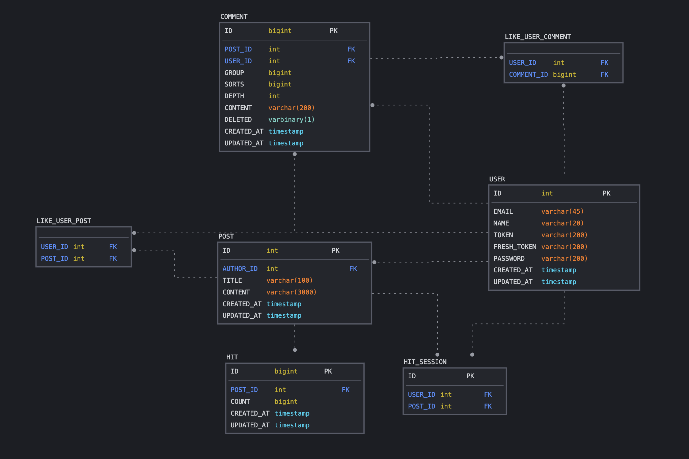

# BLOG-ADVANCED-ERD

> ERD 버전 관리
>
> [2022\. 06. 09 v1.0](#v1.0)
>
> [2022. 06. 15 v1.1](#v1.1)

 

## v1.0

> 2022\. 06. 09

##### 테이블 목록

- USER, POST, COMMENT, LIKE_USER_POST, LIKE_USER_COMMENT

##### 설명

- USER(사용자)
  - ID
    - USER 테이블의 PK
    - 사용자 확장성 고려해 BIGINT 설정
  - EMAIL(이메일)
    - 사용자의 이메일을 저장하여 메일 push 기능 사용 시 참조
  - NAME(이름)
    - 사용자가 활동 시 사용하는 이름
  - TOKEN(토큰)
    - JWT 사용 시 기본 TOKEN을 저장
  - REFRESH_TOKEN(갱신토큰)
    - JWT 사용 시 일정 시간마다 갱신되는 TOKEN을 저장
- POST(게시글)
  - ID : POST 테이블의 PK
  - AUTHOR_ID
    - 게시글의 사용자를 참조하기 위한 FK
  - TITLE(제목)
  - CONTENT(내용)
  - CREATED_AT, UPDATED_AT(생성일시, 수정일시)
    - 게시글 생성일시, 수정일시 기록
- COMMENT(댓글)
  - ID : 댓글 테이블의 PK
  - POST_ID, USER_ID
    - 댓글이 참조할 게시글과 작성자 참조를 위한 FK
  - GROUP(그룹)
    - 최초 댓글에 대한 그룹 설정하여 hirarchical 구조 구축
    - 같은 댓글의 root node 역할
  - SORTS(정렬)
    - 각 그룹 및 계층구조 DEPTH의 순서를 설정하기 위한 소팅 값
    - 같은 GROUP의 댓글이 늘어날 때마다 1씩 증가
  - DEPTH(깊이)
    - 계층구조 상 node의 깊이
    - depth 기준으로 댓글 계층구조 표현
  - CONTENT(내용)
    - 댓글의 내용 기록
  - DELETED(삭제여부)
    - 삭제 여부를 1byte 값으로 기록
    - 삭제 시 기능구현을 위한 참조값으로, 같은 그룹 또는 DEPTH의 자식 노드가 없을 시 완전 삭제, 있다면 삭제 표시하기 위한 flag 값
  - CREATED_AT, UPDATED_AT(생성일시, 수정일시)
- LIKE_USER_POST
  - 유저-게시글 간의 좋아요 관계 표현
  - USER, POST FK만을 포함하는 테이블로, 유저가 좋아요 한 게시글과 게시글에 좋아요한 유저를 계산
- LIKE_USER_COMMENT
  - 유저-댓글 간의 좋아요 관계 표현
  - USER, COMMENT FK만을 포함하는 테이블로, 유저가 좋아요한 댓글과 댓글에 좋아요한 유저를 계산

 

## v1.1

> 2022\. 06. 15
>
> 추가, 수정 부분만 명시

##### 테이블 목록

- USER, POST, COMMENT, HIT, HIT_SESSION

##### 설명

- USER
  - ID: 타입을 bigint에서 int로 변경
  - PASSWORD: 추후 패스워드 들어갈 것을 고려하여 컬럼 추가
  - CREATED_AT / UPDATED_AT
    - 사용자 가입일시, 정보 수정 일시를 고려하여 created_at, updated_at 추가
- POST
  - ID: 타입을 bigint에서 int로 변경
  - CREATED_AT / UPDATED_AT: timestamp로 타입 변경
- COMMENT
  - SORTS: sorts 컬럼을 두어야 하는지 고민 필요
  - CREATED_AT / UPDATED_AT: timestamp로 타입 변경
- HIT
  - ID: hit : post = 1:1 관계
  - COUNT: 합산한 조회수
- HIT_SESSION
  - 실제 실시간 조회수가 기록되는 테이블

##### 추가 의문사항

- 조회수에 대한 통계를 내기 위해 history 테이블 필요 유무